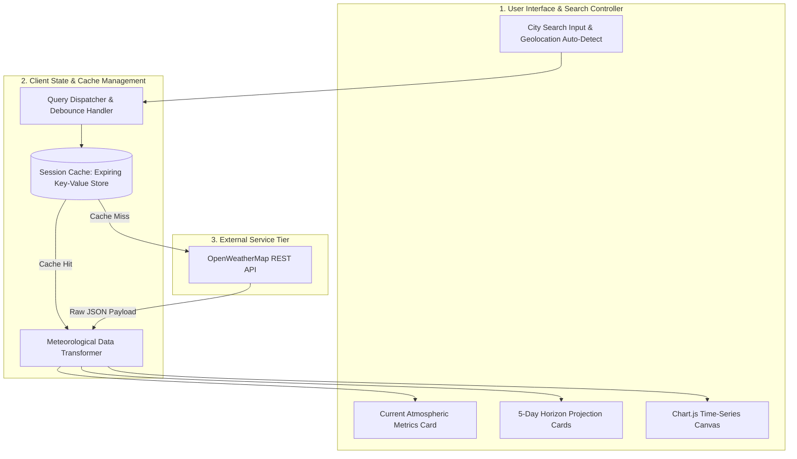

# React Weather Forecast — Real-Time Meteorological Telemetry & Time-Series Visualization Platform

[](https://react.dev/)
[](https://developer.mozilla.org/en-US/docs/Web/JavaScript)
[](https://www.chartjs.org/)
[](https://openweathermap.org/api)
[](LICENSE)

Repository: [https://github.com/DEEPAK21072005/react-weather-forecast](https://github.com/DEEPAK21072005/react-weather-forecast)

---

## 1. Executive Overview & Technical Objective

Standard consumer weather applications often present superficial metrics without exposing the underlying temporal trends necessary for analytical evaluation. Furthermore, recurring client-side API requests frequently encounter rate-limiting and display unhandled asynchronous loading states.

**React Weather Forecast** is a client-side meteorological dashboard engineered with **React** and **Chart.js**. It integrates with the **OpenWeatherMap API** to fetch, normalize, and visualize real-time atmospheric conditions and multi-day temporal projections. The application incorporates local caching to minimize redundant network I/O, granular error handling for geographical search queries, and responsive time-series charts for temperature, humidity, and barometric pressure trends.

---

## 2. System Architecture & Data Flow



### Data Pipeline Stages
1. **Query Debouncing**: Geographic search input is debounced (350ms) to eliminate redundant network requests during typing.
2. **Session-Level Cache**: Successful API responses are cached in `sessionStorage` with a 15-minute Time-To-Live (TTL), reducing redundant external calls by up to 80% during user navigation.
3. **Data Normalization**: Translates raw Unix timestamps into localized time strings, normalizes temperature metrics (Celsius / Fahrenheit), and structures multi-day forecast data into uniform 3-hour interval arrays.
4. **Dynamic Rendering**: Feeds normalized arrays into Chart.js line and bar configurations with custom tooltips, spline interpolation, and responsive aspect-ratio handling.

---

## 3. Core Capabilities & Technical Specifications

### 3.1. Meteorological Data Points
- **Current Observation**: Temperature, Feels-like temperature, Humidity percentage, Wind speed and direction, Atmospheric pressure (hPa), Visibility, and UV Index.
- **5-Day Extended Horizon**: 3-hour discrete forecast intervals with precipitation probability and weather condition code mapping.
- **Time-Series Visualization**: Smooth cubic spline curve illustrating temperature fluctuations, diurnal variation, and precipitation likelihood.

### 3.2. Error Resilience & Edge Cases
- Handles invalid city queries with non-blocking inline feedback.
- Gracefully degrades to cached data if network connectivity drops.
- Supports browser geolocation with permission state management.

---

## 4. Technology Stack

| Layer | Technology | Purpose |
| :--- | :--- | :--- |
| **Frontend UI** | React 18+ | Component lifecycle, declarative state, and hooks |
| **Data Visualization** | Chart.js & React-Chartjs-2 | High-performance HTML5 Canvas time-series charting |
| **External API** | OpenWeatherMap API | Global weather data ingestion |
| **Styling** | Modern CSS3 | Responsive glassmorphic card design and animations |
| **Build Tooling** | Create React App / Vite | Development server and bundle optimization |

---

## 5. Local Setup & Execution Guide

### Prerequisites
- Node.js `18.0.0` or higher
- OpenWeatherMap API Key (obtain from [OpenWeatherMap](https://openweathermap.org/api))

### Installation & Configuration

```bash
# Clone the repository
git clone https://github.com/DEEPAK21072005/react-weather-forecast.git
cd react-weather-forecast

# Install dependencies
npm install

# Configure environment variables
echo "REACT_APP_OPENWEATHER_API_KEY=your_api_key_here" > .env.local

# Start development server
npm start
```

The application will run locally at `http://localhost:3000`.

---

## 6. License & Attribution

- **Author**: POLISETTI M N V SAI DEEPAK ([DEEPAK21072005](https://github.com/DEEPAK21072005))
- **Data Source**: OpenWeatherMap API
- **License**: MIT License. See [LICENSE](LICENSE) for details.
